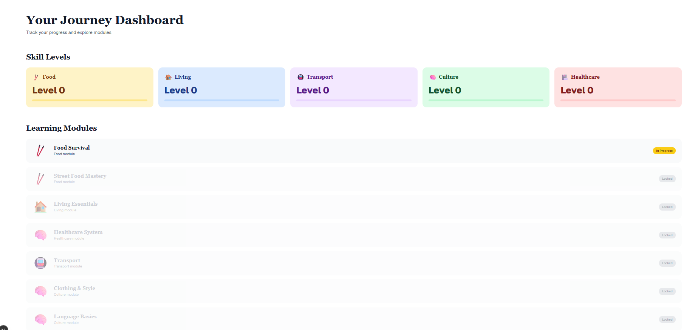

# Become Chinese

Become Chinese is a cultural onboarding web app for newcomers who want a
practical introduction to everyday life in China.




The app covers food, housing, healthcare, transport, clothing, language,
payments, work culture, social life, dating, festivals, and broader cultural
context. It is intended as educational orientation, not as official advice.

## Features

- No authentication required for the main learning flow.
- 13 learning modules with practical explanations, steps, and tips.
- Local progress tracking with `localStorage`.
- Responsive Next.js interface.
- Optional Supabase scaffolding for auth and database experiments.

## Tech Stack

- Next.js App Router
- React and TypeScript
- Tailwind CSS
- shadcn/ui-style components using Radix UI primitives
- Supabase client helpers
- Drizzle ORM scaffolding

## Getting Started

### Prerequisites

- Node.js 20.9+
- pnpm

### Installation

```bash
pnpm install
```

Create a local environment file from the example:

```bash
cp .env.example .env.local
```

Fill in the Supabase and database values only if you plan to use those optional
parts of the app.

Run the development server:

```bash
pnpm run dev
```

Open [http://localhost:3000](http://localhost:3000).

## Scripts

```bash
pnpm run dev      # Start development server
pnpm run build    # Build for production
pnpm run start    # Start production server
pnpm run lint     # Run ESLint
pnpm db:generate  # Generate Drizzle migrations
pnpm db:migrate   # Run Drizzle migrations
pnpm db:push      # Push schema to database
pnpm db:studio    # Open Drizzle Studio
```

## Compliance & Contributing

- **License**: MIT. See [`LICENSE`](LICENSE).
- **Disclaimer**: See [`DISCLAIMER.md`](DISCLAIMER.md) for content disclaimers.
- **Third-party notices**: See [`THIRD_PARTY_NOTICES.md`](THIRD_PARTY_NOTICES.md).
- **Security**: See [`SECURITY.md`](SECURITY.md) for vulnerability reporting.
- **Contributing**: See [`CONTRIBUTING.md`](CONTRIBUTING.md) for contribution guidelines.
- **Code of Conduct**: See [`CODE_OF_CONDUCT.md`](CODE_OF_CONDUCT.md).
- **Secrets**: Real credentials belong in local `.env*` files only. Use `.env.example`
  for placeholders.
- **Assets**: Static visual assets are project-created replacements for unverified
  stock/template images.

## Content Disclaimer

The content is general educational information only. It is not legal,
immigration, medical, financial, tax, employment, or safety advice. Local
rules, service availability, prices, and procedures change over time and can
vary by city. Verify important decisions with official sources or qualified
professionals.

## License

MIT
